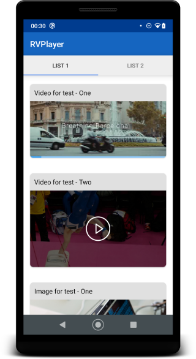
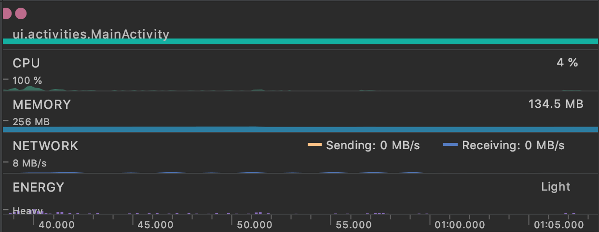

# RVPlayer - RecyclerView With ExoPlayer

[](https://github.com/paulo-coutinho/rvplayer/actions)

This is a sample project that shows how to use ExoPlayer inside RecyclerView with multiple view holders.

The objective is show the best practices to use less resources and play a single video using ExoPlayer inside a RecyclerView, since i see that a lot of people search for this.

Any suggestions and question you can use "issues" section on Github.

## Features

1. Kotlin code
2. Multiple view holders (video and image)
3. ExoPlayer latest version
4. Low resources usage (memory and CPU)
5. Easy to extend and understand (only need inherited our RecyclerView class and override methods)
6. Single video playing
7. Multiple pages inside ViewPager2 with video
8. Pixel perfect image and video load using correct calcs

## Demo

APK is automatically generated by github action here (open latest successful build and go to artifacts):

https://github.com/paulo-coutinho/rvplayer/actions

After download you need unzip it and run on terminal:

```
adb install app-signed.apk
```

## Screenshots

Demo application:



Resources usage (Moto G):



## Contribute

You can contribute coding or searching for bugs. Report on "issues" menu if have any question.

Before commit run format tool to everybody use the same code pattern:

```
make format
```

## Buy me a coffee

<a href='https://ko-fi.com/paulocoutinho' target='_blank'></a>

## License

[MIT](http://opensource.org/licenses/MIT)

Copyright (c) 2021-2021, Paulo Coutinho
